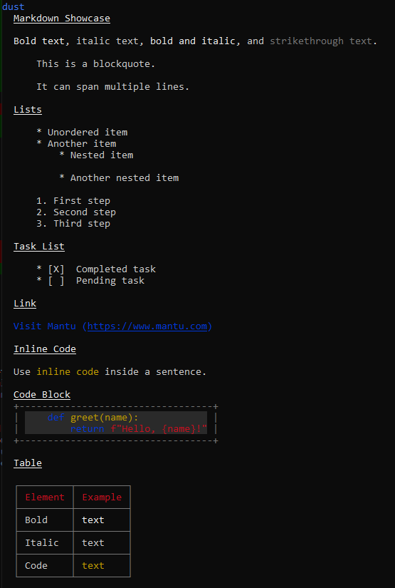
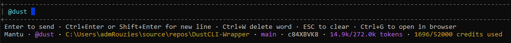
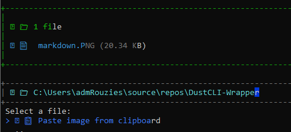
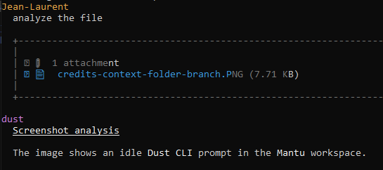

<div align="center">

# ⟡ dust-cli (dustm)

### The Mantu fork of the Dust CLI


*A hardened, restyled build of [`@dust-tt/dust-cli`](https://github.com/dust-tt/dust/tree/main/cli/dust-cli) — same agents, same account, but a more consistent console experience.*

</div>

---

## Table of Contents

- [Changelog: Mantu fork vs. upstream Dust CLI](#changelog-mantu-fork-vs-upstream-dust-cli)
- [Screenshots](#screenshots)
- [Installation](#installation)
  - [Quick install (Windows)](#quick-install-windows)
  - [Quick install (macOS / Linux)](#quick-install-macos--linux)
- [Usage](#usage)
  - [Commands](#commands)
  - [Shortcuts](#shortcuts)
  - [Steering](#steering)
  - [Status bar](#status-bar)
  - [In-Chat Commands](#in-chat-commands)
  - [Modes](#modes)
  - [Loops](#loops)
  - [Claude Code mode](#claude-code-mode)
  - [Headless Authentication](#headless-authentication)
- [Development](#development)
  - [Versioning](#versioning)
- [Relationship to Upstream](#relationship-to-upstream)
- [License](#license)

---

## Changelog: Mantu fork vs. upstream Dust CLI

### ✨ Added

| Feature | Notes |
|---|---|
| Markdown rendering | Syntax-highlighted code fences, boxed on their own |
| Transient "Thinking…" status | `◊` icon pulsing between brand colors instead of a permanent scrollback dump |
| Persistent, colorized status bar | Workspace, agent, folder, branch, tokens, credits — see [Status bar](#status-bar) |
| Ctrl+Enter / Shift+Enter | Multi-line input |
| `todo_write` tool | Claude-Code-style task checklist (`--with-tools` only) |
| Dust directive handling | Web-only directives (e.g. `:preview_file{...}`) shown as readable placeholders; citation refs (`:cite[...]`), which the web app turns into clickable footnotes but carry no information without that link data, are stripped instead of leaking mid-sentence |
| Clipboard image paste | Attach a screenshot straight from the clipboard via Ctrl+V or `/attach` — Windows tested, macOS untested — see [In-Chat Commands](#in-chat-commands) |
| Paste compaction | Large multi-line pastes collapse to a `[Pasted N lines of text]` placeholder while composing, instead of dumping the raw text inline; the full content is what's shown in the transcript and sent once you hit Enter - the placeholder never lands in permanent scrollback |
| Portable content search | `search_content` (`--with-tools`) no longer shells out to the system `grep` binary, and supports lines of context around each match |
| `write_file` tool | Local file creation/overwrite (`--with-tools`), so "create a file" lands on disk in the current folder instead of Dust's hosted, web-only file preview |
| Message queuing | Type and send while the agent is still working — queued messages show in a bordered box below the input and auto-send in order once the current turn ends; recall the last one with Up-arrow/Backspace to edit or cancel it |
| Real steering (`Ctrl+S`) | Genuinely interrupts the current turn server-side (via `cancelMessageGeneration`, not just a client-side disconnect) and sends your message as a redirect — see [Steering](#steering) for how it works and its limits |
| Shell-history recall (Up/Down) | When there's nothing queued, Up-arrow steps backward through this conversation's own previously sent messages (Down steps forward again) |
| Persistent file-change previews | Approved `write_file`/`edit_file` previews stay in scrollback after the turn finishes, instead of disappearing once the approval prompt closes |
| Immediate startup feedback | Prints "Starting dustm..." right away, before the (larger) UI dependency graph finishes loading, so the CLI doesn't look stuck on a slow/cold start |
| Visible retry indicator | API/MCP call retries now show a spinner + `[attempt/max] Retrying ... — <error>` line instead of only ever showing up in `~/.dust-cli/logs/` - previously indistinguishable from "it didn't retry at all" |
| Plan mode + Shift+Tab modes | `/plan` (or `--plan`) makes the agent research read-only and get a plan approved before it edits anything. Shift+Tab cycles **normal → auto-edit → plan**, always shown in the status bar, replacing the undocumented binary auto-accept toggle it used to be. Approved plans render as a bordered, markdown-styled document naming the file they were saved to — see [Modes](#modes) |
| `/loop` and `--loop` | Re-send a prompt on an interval, so unattended work ("check CI and fix what's broken") can keep going without you retyping it. Interactive in the chat, or headless for CI — see [Loops](#loops) |
| `/claude-code-mode` | Primes the Dust agent with the memories Claude Code keeps for this folder, plus the repo's own `CLAUDE.md`/`AGENTS.md` — so a Dust agent starts with the same background your coding CLI has. Comes with `read_memory`/`write_memory` tools so the agent can maintain those memories too — see [Claude Code mode](#claude-code-mode) |
| `@` file mentions | Type `@` to fuzzy-search the current folder and insert `@relative/path` at the cursor, rendered in dim gold italic so it's easy to pick out from the rest of the draft — same fuzzy-picker UI as `/attach` |
| Resume command on exit | A second Ctrl+C prints `dustm --agent <name> --conversationId <id>` right before exiting, so a reflexive double-press to interrupt a runaway turn doesn't cost you the conversation |
| Immediate "Cancelling…" feedback | Esc/Ctrl+C now shows a red `✗ Cancelling` status the instant it's pressed, instead of leaving "Thinking…" up for the couple of seconds `cancelMessageGeneration` takes to actually confirm the cancel server-side |
| Mid-turn context/credit refresh | The status bar's usage numbers now update after every completed tool call, and every ~20s during a long stretch of plain-text generation — previously they only refreshed once the whole turn finished, so a long task showed no movement in the meantime |
| Clean exit from `dustm login` | Prints "Push 'Enter' to exit, and use 'dustm' to start a chat." and actually exits on Enter — it used to just sit there with no indication the process was done, other than Ctrl+C |
| LaTeX math rendering | `$...$` / `$$...$$` spans (Greek letters, `\frac`, `\sqrt`, accents, sub/superscripts) converted to readable Unicode before markdown ever sees them, since a terminal can't typeset real math |
| Crash recovery | Falls back to fetching the conversation from the server instead of showing a fatal error |
| Auto-retry on API errors | Up to 5x with backoff on transient failures; skipped for non-idempotent calls |
| Actionable error messages | Fatal errors include the exact command to resume that conversation |
| Local crash-safe transcripts | Every turn appended to `~/.dust-cli/transcripts/<id>.jsonl` |
| Ctrl+C safety net | Genuinely cancels generation server-side (via `cancelMessageGeneration`) if running, not just a client-side disconnect; otherwise double-press within 2s to exit |
| `/clear` command | Alias for `/new` — the more familiar name from other chat UIs |

### 🐛 Fixed

| Issue | Root cause |
|---|---|
| Multi-line paste corrupted input / submitted early | No bracketed-paste support — pasted newlines triggered submit |
| No Ctrl+Backspace / Ctrl+Left/Right word-jump | Never implemented upstream |
| Transient stream errors showed a fatal, unrecoverable error | Never checked whether the answer had actually completed server-side |
| Agent list / MCP / user-info fetches failed on one hiccup | No retry logic anywhere |
| UI glyphs rendered as garbage or misaligned boxes | Unicode glyphs unsupported on this console's font |
| `search_content` (`--with-tools`) could silently fail | It shelled out to the system `grep` binary, not guaranteed to exist on plain Windows without Git for Windows/WSL |
| Agent sometimes tried to run commands/create files in an unrelated sandbox | `run_command`'s description didn't distinguish it from Dust's own hosted, sandboxed code-interpreter tool — clarified to state it runs on the user's real local machine and current folder |
| Terminal flickered, and fought manual scrolling, on long agent answers | The live streaming preview re-rendered the *entire* accumulated answer every second with no height limit — each redraw is new output, so the terminal auto-scrolled to reveal it, overriding any manual scroll-up; now capped to a small, constant-size tail (same footprint as the "Thinking" spinner) regardless of answer length |
| `/new` (and `/clear`) left the old status bar/input box visible above the fresh one instead of replacing it | `clearTerminal()` writes raw ANSI codes directly to stdout, bypassing Ink's own render bookkeeping — the next render doesn't know the screen was wiped, so it doesn't correctly replace the previous frame. Same class of artifact already worked around for terminal *resizes*; now the same fix (forcing a full remount) applies here too |
| Multi-line input rendered corrupted — cursor looked stuck on the first line, and moving it left could leave stale text behind | The cursor-highlighted line was built from three sibling `<Text>` elements instead of one nested `<Text>`; Ink only wraps/tracks height correctly within a single `Text` subtree, so a long or wrapped row overflowed it and the next keystroke's redraw didn't fully clear the old frame |
| `End` (and `Home`) did nothing in the input box | Ink's parser recognizes these keys internally but the `key` object handed to `useInput` has no `.home`/`.end` field at all — both arrived as a complete no-op. Now detected from the raw escape sequence directly, the same way Delete is already disambiguated from Backspace |
| Conversation ID in the status bar didn't match the one shown in the web app (or work with `--conversationId`) | It was truncated to 8 characters; now shown in full |
| Creating a file dumped its entire contents into the chat, unbounded | A new file has no real diff — every line is a `+` — and the permanent transcript view of `write_file`/`edit_file` changes had no line cap, unlike every other place this CLI shows tool output. Now capped at 30 lines with a "N more lines not shown" note, same as the ephemeral approval preview |

---

## Screenshots

**Markdown rendering** — headings, lists, task lists, links, inline code, tables, and syntax-highlighted code blocks:

<p align="center">
  
</p>

**Status bar** — workspace, agent, folder, branch, conversation ID, context usage, and consumed credits:



**Clipboard image paste** — Ctrl+V or `/attach`'s "Paste image from clipboard" option, which the agent can then read like any other attachment. Verified on Windows; the macOS path uses the same approach via AppleScript but hasn't been tested on a real Mac yet:

<p align="center">
  
</p>

<p align="center">
  
</p>

---

## Installation

### Quick install (Windows)

One line, no prerequisites — installs NVM for Windows, Node.js, and builds and links this fork:

```powershell
irm "https://raw.githubusercontent.com/jlrouzies-mantu/dust-cli/main/scripts/Install-DustCLI.ps1?nocache=$((Get-Date).Ticks)" | iex
```

### Quick install (macOS / Linux)

Same idea, via `nvm` instead of NVM for Windows — untested on a real Mac/Linux box, please report back if it doesn't work:

```bash
curl -fsSL "https://raw.githubusercontent.com/jlrouzies-mantu/dust-cli/main/scripts/install-dustcli.sh?nocache=$(date +%s)" | bash
```

### Manual install

```bash
git clone <this-repo-url>
cd dust-cli
npm install
npm run build:prod
npm link   # optional: makes `dustm` available globally
```

### Linux

`dustm` depends on [`keytar`](https://www.npmjs.com/package/keytar) for storing credentials. On Linux, `keytar` requires `libsecret`:

- Debian/Ubuntu: `sudo apt-get install libsecret-1-dev`
- Red Hat-based: `sudo yum install libsecret-devel`
- Arch Linux: `sudo pacman -S libsecret`

This fork reads the exact same credentials the official CLI stores — if you've already run `dust login`, it picks up that session automatically. No separate login step needed.

## Usage

```bash
dustm [command] [options]
```

When no command is given, `chat` is used by default.

### Commands

| Command | Description |
|---|---|
| `login` | Authenticate with your Dust account (`--force` to re-authenticate) |
| `status` | Check your current authentication status |
| `logout` | Log out |
| `skill:init` | Install the dustm skill for coding CLIs (Claude Code, Codex) |
| `chat` | Chat with a Dust agent (default command) |
| &nbsp;&nbsp;`--loop <interval>` | Re-send `--message` on an interval (requires `--message`) — see [Loops](#loops) |
| &nbsp;&nbsp;`--maxRuns <n>` | Cap on `--loop` runs (default 50) |
| &nbsp;&nbsp;`--loopFreshConversation` | Start each `--loop` run in a new conversation instead of continuing one |
| &nbsp;&nbsp;`--agent "<name>"` / `-a` | Search for and use an agent by name |
| &nbsp;&nbsp;`--sId <sId>` / `-s` | Specify an agent's sId directly |
| &nbsp;&nbsp;`--resume <conversationId>` / `-r` | Resume a past conversation |
| &nbsp;&nbsp;`--auto` | Automatically accept all file-edit operations without prompting |
| &nbsp;&nbsp;`--plan` | Start in plan mode: research only until you approve a plan — see [Modes](#modes) |
| &nbsp;&nbsp;`--message "<text>"` / `-m` | Send one message non-interactively and exit |
| `help` | Display help information |

### Shortcuts

| Keys | Action |
|---|---|
| `Enter` | Send message |
| `Shift+Tab` | Cycle permission mode: normal → auto-accept edits → plan → normal. Works mid-turn — see [Modes](#modes) |
| `Ctrl+Enter` / `Shift+Enter` | Insert a newline |
| `Ctrl+W` | Delete the previous word (more reliable than Ctrl+Backspace across terminals) |
| `Ctrl+Backspace` | Delete the previous word (best-effort — not every terminal reports it distinctly from plain Backspace) |
| `Ctrl+Delete` | Delete the next word |
| `Ctrl+Left` / `Ctrl+Right` | Jump to the previous/next word |
| `Home` / `End` | Jump to the start/end of the current line |
| `@` | Fuzzy-search the current folder and insert a file reference at the cursor |
| `Esc` | Clear input if there's a draft, otherwise cancel the current generation (genuinely, server-side - see [Steering](#steering)) |
| Enter (while the agent is working) | Queue the message — sent automatically once the current turn ends |
| `Ctrl+S` (while the agent is working) | Steer — see [Steering](#steering) |
| Up-arrow / Backspace on an empty input | Recall the last queued message for editing — clear it with `Esc` to cancel, or just send it. With nothing queued, Up/Down instead step through this conversation's own message history (shell-style) |
| `Ctrl+C` | Cancel generation if one is running (same as Esc); press twice within 2s to exit while idle |
| `Ctrl+G` | Open the current conversation in the browser |


### Status bar

A persistent, colorized line at the bottom of the chat shows:

```
□ normal · workspace · ~/current/folder · git-branch · a1b2c3d4 · 14.5k/272k (5%) context · 1595/52000 (3%) credits used
```

The [permission mode](#modes) leads the line and is always present — it's the one field that changes what the agent is allowed to do, so it gets the most stable position while the segments after it come and go depending on what's available.

Context-window usage and consumed credits come from endpoints the Dust web dashboard itself calls internally (`/api/w/{workspaceId}/credits/my-usage` and `.../assistant/conversations/{id}/context-usage`) — not the public, documented `/api/v1` API. They work with the same Bearer token this CLI already has, but Dust hasn't committed to supporting them for external clients, so they could change or disappear without notice. If either call fails, that piece of the status bar just silently omits itself rather than erroring.

### In-Chat Commands

- **`/exit`** — exit the chat session
- **`/switch`** — switch to a different agent
- **`/new`** / **`/clear`** — start a new conversation on a fully blank terminal (screen *and* scrollback cleared, same as launching `dustm`). Both do the same thing — `/clear` is just the more familiar name from other chat UIs
- **`/attach`** — open a file selector to attach a file (includes a "Paste image from clipboard" option — also bound to Ctrl+V directly; Windows tested, macOS untested)
- **`/clear-files`** — clear any attached files
- **`/auto`** — toggle auto-approval of file edits (or `Shift+Tab`)
- **`/plan`** — toggle plan mode (or `Shift+Tab`) — see [Modes](#modes)
- **`/loop <interval> [xN] <prompt>`** — re-send a prompt on an interval; `/loop stop` cancels, `/loop` alone shows status — see [Loops](#loops)

### Modes

`Shift+Tab` cycles one permission mode. They're modelled as a single tri-state rather than independent switches because the two non-default modes contradict each other — plan mode blocks every writing tool, so "auto-approve edits" would have nothing left to approve.

| Mode | Status bar | Behaviour |
|---|---|---|
| Normal | `□ normal` (grey) | You approve each file edit |
| Auto-edit | `»» auto-edit` (amber) | Edits apply without prompting (same as `/auto`, `--auto`) |
| Plan | `■ plan` (teal) | Research only — `write_file`, `edit_file` and `run_command` are all blocked until you approve a plan (same as `/plan`, `--plan`) |

The mode is **always** in the status bar, normal included, and leads the line so it holds the most stable position. An absent indicator would be ambiguous — nothing engaged, or just scrolled off? The glyphs are a progression of how much the agent may do unsupervised (hollow → forward → sealed) rather than a pause/play metaphor, and the three colours are their own set: they mark a standing permission level, not pending work, so they deliberately don't borrow the gold/purple/blue of the Queued, Steered and Looping blocks.

Shift+Tab works **mid-turn** — switching to plan mode because you saw the agent about to do something you don't want is exactly when you need it. Changing mode writes nothing to the chat area: the status bar carries it permanently, and cycling would otherwise spray a line per press.

#### Plan mode

While plan mode is on, **every outgoing message carries a short statement of it** (~800 bytes) plus a one-line reminder after your text. Without that, the mode is only discoverable by trying to write something and being refused — so asking for something that needs no file writes at all ("plan me a calendar app") would never reveal plan mode existed, and you'd get prose with no plan submitted. The statement also explicitly permits answering a plain question directly, so the agent doesn't file a plan just to explain something.

The agent researches with the read-only tools, then calls `present_plan`. You get a preview and four choices:

| Choice | Effect |
|---|---|
| **Approve and implement in auto mode** | Plan mode off, **auto-edit on** — it carries the plan out without asking per edit (you just approved the whole thing) |
| **Approve and wait for further instructions** | Plan mode off, back to **normal** — it acknowledges and *stops*, so you can add instructions before it starts |
| **Reject with comment** | Prompts you for a reason, passes it to the agent verbatim, stays in plan mode |
| **Reject** (or `Esc`) | Stays in plan mode with no reason given — the agent is told to rethink rather than resubmit the same plan |

Approval is the *only* thing that lifts the restriction, so the agent can't grant it to itself by calling `present_plan` and assuming success. The two approvals are reported differently on purpose: collapsing them would leave the agent guessing, and guessing wrong on the second means it starts editing while you're still typing.

**How much of this is a guarantee:** the block is — `write_file`, `edit_file` and `run_command` check the mode before doing anything, verified by tests that assert the target file on disk is untouched. Whether the agent calls `present_plan` *before* reaching for a writing tool is guidance, not enforcement: a weaker agent may try to write first, get refused, and only then plan. Nothing is written either way.

Two layers steer it toward calling `present_plan` first, in increasing order of how close they sit to the decision: a short statement riding on every message while planning (so the mode is knowable even for a request that needs no writes at all — otherwise it's only ever discovered by trying to write and being refused), and a note appended to `write_file`'s, `edit_file`'s and `run_command`'s own tool descriptions, which is in context at the exact moment the agent is choosing a tool — the strongest place to put it, and where an agent that ignored the first layer and reached straight for a writing tool still has one more chance to redirect before wasting a turn on a refusal.

**The plan itself appears exactly once, the moment it's proposed** — before you've even chosen an option — as a bordered document with the markdown rendered (headings, lists, inline code, syntax-highlighted fences: the same pipeline agent answers go through). Once you decide, a small, separate block appears below it stating the outcome and, if approved, the file it was saved to:

```
╭──────────────────────────────────────────────────────────────╮
│ ◇ Plan proposed — awaiting your decision
│ Add retry to the upload path
│
│ What changes
│   * src/utils/upload.ts — wrap putObject in retryResult
…
╰──────────────────────────────────────────────────────────────╯
╭──────────────────────────────────────────────────────────────╮
│ ■ Plan approved · ~/.dust-cli/plans/t9dTl8j80I-1.md
╰──────────────────────────────────────────────────────────────╯
```

That split exists because of a real bug, not just for tidiness: the plan text used to appear only inside the approval prompt itself, redrawn on every keystroke like any other ephemeral UI. Ink erases and repaints that kind of content by moving the cursor up a fixed number of lines and redrawing — arithmetic that quietly breaks once the content is taller than the terminal, which a real plan usually is. The visible symptom was the plan appearing twice: the old copy never fully erased, sitting above a second, permanent copy printed after the decision. Printing the plan exactly once, immediately, as permanent scrollback — and never again as ephemeral content — is what actually fixes that, rather than just capping how much of it a keystroke was allowed to redraw. The approval prompt itself now shows only a one-line pointer at the plan already on screen above it, plus the four options.

Approved plans are written to `~/.dust-cli/plans/<conversationId>-<n>.md` so they can be reread, diffed or committed afterwards; the path is shown because that's the whole point of saving it. A rejected plan stays in scrollback (greyed, marked not saved) since it's the thing the next revision revises.

**`run_command` is blocked outright while planning**, not filtered. There's no reliable way to tell a read-only invocation from a mutating one — `git log` is harmless, `git reset --hard` isn't, and both arrive as the same shape — and an allowlist would be a security boundary this code isn't positioned to enforce (shell metacharacters, aliases, scripts that shell out further). Research uses `read_file`, `search_files` and `search_content` instead, and the refusal message says so rather than leaving the agent to guess.

In a non-interactive run there's no one to approve anything, so `present_plan` refuses and says why instead of silently switching plan mode off — which would hand the agent exactly the write access you withheld. `--plan` with `--message` is rejected as a usage error for the same reason.

**You won't be asked to approve blocked tools.** Dust has its own server-side tool-approval prompt that fires *before* a tool runs and knows nothing about plan mode — so without special handling, planning meant being asked to approve a write that this CLI was then guaranteed to refuse, which reads as plan mode not working. While planning, that prompt is skipped for the three blocked tools and the call goes straight through to the refusal, whose message explains plan mode and points at `present_plan`. (Rejecting it instead would abort with a bare "rejected by user" and teach the agent nothing.)
- **`/claude-code-mode`** — prime the agent with your Claude Code memories for this folder — see [Claude Code mode](#claude-code-mode)

### Loops

Runs one prompt over and over on an interval, for work that needs re-checking rather than a single answer.

```
/loop 10m check CI and fix any failures
/loop 30s x5 poll the deploy and report when it finishes
/loop stop
/loop                 # status: interval, runs so far, ticks skipped
```

It runs **once immediately**, then on the interval. Cancel with `/loop stop`, `Esc`, or `Ctrl+C` — Esc and Ctrl+C stop the loop *and* cancel the current turn, since cancelling only the turn would let the next tick re-send moments later and read as the key not working. `/new` stops it too: its prompt was written for the conversation you just discarded.

**Guardrails, because a loop spends credits unattended:**

| | |
|---|---|
| Interval floor | **30s.** A turn plus its tool calls rarely finishes faster, so shorter ticks would mostly be skipped — a confusing way to burn credits |
| Interval ceiling | 24h |
| Run cap | 50 by default, `xN` to lower it, 500 hard ceiling |
| Never overlaps | A tick that fires while the agent is still working is **skipped, not stacked** — and the skip count shows in `/loop` status and the status line |
| Units required | `/loop 5 …` is rejected rather than guessed. Seconds and minutes differ by 60×, and reading "5" as seconds when minutes were meant is 60 turns instead of one |

An armed loop shows a **persistent blue block** above the input, in the same filled-block style as Queued (gold) and Steered (purple) — blue for "repeating on a timer". Unlike those two it isn't gated on anything being pending: it stays up for as long as the loop is armed, because the loop sends messages and spends credits on its own. It carries the prompt, the run counter, whether a tick is waiting, and how many were skipped:

```
 Looping (12/50) — every 5m · next run queued · 2 skipped (agent busy) · Esc or /loop stop to cancel
 check CI and fix any failures
```

It's rendered closest to the input so it keeps a fixed position as the Queued and Steered blocks come and go, and on a narrow terminal it drops segments by priority rather than truncating — the run counter and interval always survive, and the cancel hint goes before the dynamic state does. Loop ticks are deliberately kept out of the gold Queued block: showing the same prompt in both would read as two pending messages when there's only one.

Implementation note: a tick doesn't send directly, it appends to the existing message queue. So "never overlap a running turn" and "show what's pending" are the behaviour queued messages already had, not new code.

#### Headless (CI)

```bash
dustm chat -a MyAgent -m "check CI and fix any failures" --loop 10m --maxRuns 6
```

Runs strictly sequentially — the next iteration starts only after the previous answer arrives, then waits out the interval, so a slow turn delays the schedule instead of stacking requests. One JSON object is printed per run, so output stays parseable line by line.

Every run continues the **same conversation** by default, so the agent accumulates context across iterations (that's what lets "fix what's broken" converge instead of restarting from nothing). Pass `--loopFreshConversation` for independent runs. A failed run stops the loop with exit 1 rather than hammering a broken endpoint; a cancelled one exits 2.

### Claude Code mode

`/claude-code-mode` gives a Dust agent the same durable background [Claude Code](https://claude.com/claude-code) carries about you and the folder you're in, so you don't have to re-explain it in the chat.

Toggling it on reads, all best-effort — a missing file is simply skipped:

| Source | Path |
|---|---|
| This folder's memories | `~/.claude/projects/<encoded-cwd>/memory/*.md` |
| Its index | `MEMORY.md`, in that folder or alongside the memories |
| Your user-level memories | `~/.claude/memory/*.md` |
| Your user-level instructions | `~/.claude/CLAUDE.md` |
| The repo's own instructions | `CLAUDE.md`, `CLAUDE.local.md`, `.claude/CLAUDE.md`, `AGENTS.md` |
| Rules split out of those | `.claude/rules/**/*.md` (repo) and `~/.claude/rules/**/*.md` (user-level) |

Rules are the documented way to keep `CLAUDE.md` small, so a repo that has moved its conventions there would otherwise prime with almost nothing. They're loaded broadest-first: user-level rules, then `CLAUDE.md`/`AGENTS.md`, then the repo's own rules last.

A rule may carry a `paths:` frontmatter glob restricting it to matching files. Claude Code loads such a rule only when it touches a matching file — but a Dust chat has no "currently open file", so that condition can't be evaluated here. Rather than guess, scoped rules are included **and labelled**: the agent is told the glob and instructed to apply the rule only if the work involves those files. The terminal summary shows the scope too, since a scoped rule may end up not applying at all.

#### How Claude Code scopes memories

Worth knowing, because it decides what this mode can see — and it's stated explicitly to the agent, in the priming block and in both tool descriptions, so it doesn't reason badly about the notes it's been handed or file new ones in the wrong place:

| Scoped by | Not scoped by |
|---|---|
| The **exact working directory**, encoded into a folder name under `~/.claude/projects/` by replacing every non-alphanumeric character with a dash — `C:\Users\you\source\repos\dust-cli` → `C--Users-you-source-repos-dust-cli` | **The repository.** It's the cwd, not the git root: a subdirectory of a repo, a second checkout, and a clone at a different path each get their own separate memory set |
| A second, **user-level** store at `~/.claude/memory/`, shared by every project | **The git branch.** Every branch shares one memory set, so a memory must not describe state that's only true on one branch |
| | **The session.** Memories persist across sessions — that's the point — so anything that only matters until the end of one conversation doesn't belong in a memory |

This CLI encodes the current directory the same way Claude Code does and looks for that folder. If Claude Code has never run here, there's nothing project-specific to load and the mode says so instead of switching on silently.

#### Keeping the context bill down

Priming does **not** unconditionally dump every memory. Claude Code's own model is to load the one-line `MEMORY.md` index each session and pull individual memory files in only when they look relevant; this mirrors that, with a threshold:

- **Under 12k characters of memory bodies** (the normal case — memories are written one fact per file, so they're tiny): everything goes in verbatim, marked `complete="true"`. No tool round trip needed.
- **Over it**: the block carries a **catalogue** instead — one line per memory with its name, scope, type and summary — and tells the agent these are titles, not content, to read the ones it needs with `read_memory` and *not* to read them all. In testing, 43 memories holding ~43 KB of bodies came to an 8.8 KB catalogue.

The terminal summary says which mode you got, since it changes what the agent can answer without a tool call. `read_memory` is catalogue-first for the same reason: its cheapest call lists memories rather than returning them, bodies come back only for memories the agent names, and `all: true` exists but is documented as expensive.

The terminal shows exactly what was picked up, and `◊ claude code mode on` sits under the input box while it's active:

```
◊ Claude Code mode on - the agent will be primed with:
  · 3 project memories
  · 1 global memory
  · MEMORY.md (index)
  · AGENTS.md (8.4 KB)
  Sent once, with your next message. It is not shown in the transcript.
```

**It's sent once, riding along with your next message** — not as a message of its own. Both cost the same tokens, but a standalone priming message spends a whole round trip (and credits) on a context dump the agent can only reply to with an acknowledgement. The mechanism is the same one steering already uses: what reaches the agent is wrapped, what lands in your scrollback is only ever what you typed. After that first message the memories live in the conversation's history like anything else, so toggling the mode back off doesn't retract them — use `/new` for a conversation without them. `/new` while the mode is still on re-primes the fresh conversation automatically.

On top of that, everything is capped at ~80k characters total (~20k tokens) with a 24k-character ceiling per file, so a large `AGENTS.md` can't crowd out the conversation. Memories get first claim on that budget — costed as one catalogue line each when they're catalogued, so a big memory store can't starve the instruction files out either. Anything dropped is named in the summary rather than silently omitted.

#### Letting the agent maintain memories

Two tools come with this (registered alongside the other `fs-cli` tools, so they're available in interactive chat):

- **`read_memory`** — list the memories (default), or read specific ones in full by slug. Catches memories written mid-session, including by Claude Code in another window, and is how the agent reads bodies when priming only gave it the catalogue.
- **`write_memory`** — create, update, or delete a memory. Writes Claude Code's exact frontmatter format (`name`, `description`, `metadata.type` of `user`/`feedback`/`project`/`reference`) and keeps `MEMORY.md`'s pointer list in step, so files this CLI writes are picked up by Claude Code and vice versa. `scope: "global"` stores user-level instead of per-project.

Memory writes land outside your repo, under `~/.claude`, where a stray write is less visible than one in the working tree — so **every one shows a diff preview and needs your approval**. Unlike `edit_file`, they're deliberately never pre-approved, and `/auto` does not cover them. Memory names are restricted to a kebab-case slug, which also means a name from the agent can't traverse out of the memory directory.

The tools are registered whether or not the mode is on — MCP advertises its tools once, when the chat starts, so a mode toggled on later couldn't add them. What the mode changes is whether the agent is *told* your memories exist.

**A caveat worth knowing:** `~/.claude`'s layout and the memory file format are Claude Code's own internals, not a documented contract — they could change without notice. Every read here degrades to "absent" rather than failing, so the worst case is the mode reporting less than you expected.

### Headless Authentication

For CI/CD and automated workflows, skip interactive login entirely:

```bash
export DUST_API_KEY="sk_your_api_key_here"
export DUST_WORKSPACE_ID="ws_abc123"
dustm chat --agent "MyAgent" --message "hello"
```

or via flags: `dustm chat --wId ws_abc123 --key sk_your_api_key_here`.

**Note:** this auth path only works for chat/messages — the local filesystem/shell tool-use subsystem (`--with-tools`) requires a full OAuth session (`dustm login`), not a workspace API key.

## Development

```bash
npm install
npm run build        # dev build - points at http://localhost:3000, NOT the real API
npm run build:prod    # production build (bakes in the production API domain)
node dist/index.js <command>
```

**If `dustm` (or `node dist/index.js`) fails with `fetch failed` / `ECONNREFUSED` against `localhost:3000`**, that's this: the last build was a dev build, which intentionally points at a local Dust server (for engineers developing against a local `dust-tt/dust` checkout) that isn't running on your machine. Run `npm run build:prod` and try again - this isn't a network or retry bug.

`npm run dev` watches and rebuilds on change.

### Versioning

Plain semver (`X.Y.Z`), independent of whatever version upstream `dust-tt/dust` is on — these are this fork's first releases, so it starts at `0.1.0` rather than pretending to be further along. Bump `Z` for a routine fix, `Y` for a batch of related changes, `X` for a major rework or an upstream resync. Pushing a tag `vX.Y.Z` triggers [`.github/workflows/release.yml`](.github/workflows/release.yml), which builds and publishes the Windows/macOS installable release.

## Relationship to Upstream

This is a **standalone repository**, not a GitHub-native fork of [`dust-tt/dust`](https://github.com/dust-tt/dust). GitHub can only fork an entire repository, and `dust-tt/dust` is a large monorepo containing Dust's whole platform — forking all of it just to maintain one CLI subdirectory (`cli/dust-cli`) would be unnecessarily heavy and awkward to keep in sync. Instead, this repo contains just that subdirectory's contents at its root.

### Keeping this fork up to date

To pull in upstream fixes/features, just ask your coding agent (Claude Code, Codex CLI, etc.):

> Follow [`AGENTS.md`](AGENTS.md) and sync any new upstream changes from `dust-tt/dust` into this fork.

[`AGENTS.md`](AGENTS.md) tracks exactly which upstream commit this fork was last synced against, lists the Mantu-specific changes that a sync must not blindly overwrite, and has the step-by-step procedure for diffing and porting upstream's `cli/dust-cli` changes by hand (there's no shared git history to `git merge`/`git subtree` against, since this repo only contains that one subdirectory's contents).

## License

MIT — see [`LICENSE`](./LICENSE). Original work © Dust; fork initiated by Jean-Laurent (Mantu).
